= EC4747 Class Presentation on EMail Classification
:author:  Berend Tober and Matt Buhler
:backend: slidy
:asciimath:
:max-width: 80

== Introduction

== Data

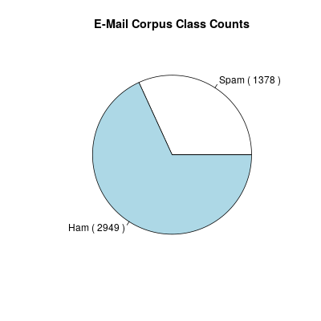

== Data

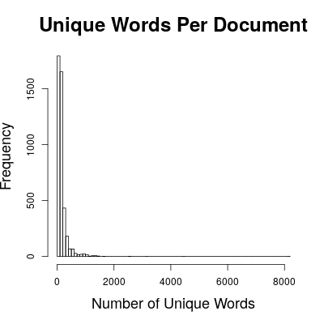

== Data

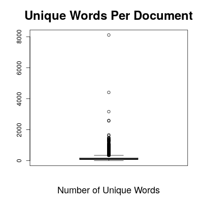

== Data

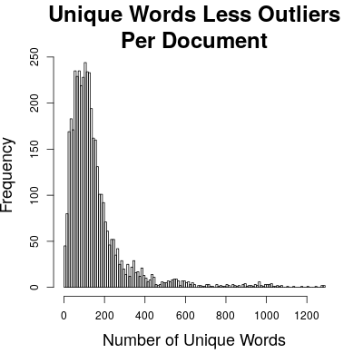

== Data
[cols="asciidoc,asciidoc"]
|=====================
|

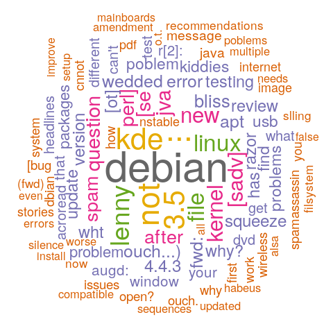

.1+|

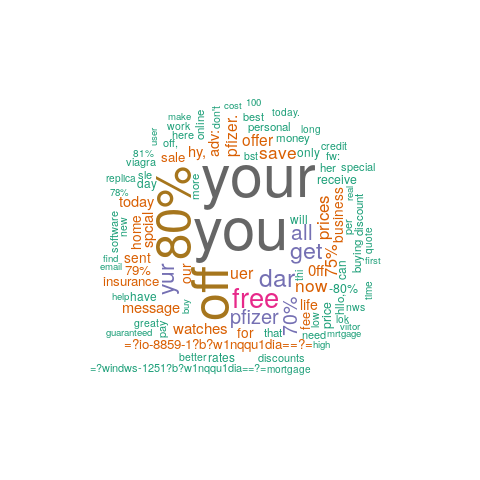

|=====================

  
== Four Contrived Sample Documents
..........................
==> examples/poem.eml <==
From: noone@example.com 
Subject: A poem about foxes

The nimble brown and white fox jumped over
the sleeping dog.

The brown and black dog awoke, looked up at
the fox and said, "Woof!"
..........................

== Four Contrived Sample Documents
..........................
==> examples/song.eml <==
From: noone@example.com
Subject: A song about foxes 

What does the fox say? Ding ding ding da
ding da ding ding.

..........................

== Four Contrived Sample Documents
..........................
==> examples/skit.eml <==
From: noone@example.com
Subject: A skit about spam

Man:      You sit here, dear.   
Wife:     All right.
Man:      Morning!
Waitress: Morning!
Man:      Well, what've you got?
Waitress: Well, there's egg and bacon; egg sausage and bacon; egg and spam; egg bacon and spam; egg bacon sausage and spam; spam bacon sausage and spam; spam egg spam spam bacon and spam; spam sausage spam spam bacon spam tomato and spam;
Vikings:  Spam spam spam spam...
Waitress: ...spam spam spam egg and spam; spam spam spam spam spam spam baked beans spam spam spam...
Vikings:  Spam! Lovely spam! Lovely spam!
Waitress: ...or Lobster Thermidor a Crevette with a mornay sauce served in a Provencale manner with shallots and aubergines garnished with truffle pate, brandy and with a fried egg on top and spam.
Wife:     Have you got anything without spam?
Waitress: Well, there's spam egg sausage and spam, that's not got much spam in it.
Wife:     I don't want ANY spam!
Man:      Why can't she have egg bacon spam and sausage?
Wife:     THAT'S got spam in it!
Man:      Hasn't got as much spam in it as spam egg sausage and spam, has it?
Vikings:  Spam spam spam spam... (Crescendo through next few lines...)
Wife:     Could you do the egg bacon spam and sausage without the spam then?
Waitress: Urgghh!
Wife:     What do you mean 'Urgghh'? I don't like spam!
Vikings:  Lovely spam! Wonderful spam!
Waitress: Shut up!
Vikings:  Lovely spam! Wonderful spam!
Waitress: Shut up! (Vikings stop) Bloody Vikings! You can't have egg bacon spam and sausage without the spam.
Wife:     I don't like spam!
Man:      Sshh, dear, don't cause a fuss. I'll have your spam. I love it. I'm having spam spam spam spam spam spam spam beaked beans spam spam spam and spam!
Vikings:  Spam spam spam spam. Lovely spam! Wonderful spam!
Waitress: Shut up!! Baked beans are off.
Man:      Well could I have her spam instead of the baked beans then?
Waitress: You mean spam spam spam spam spam spam... (but it is too late and the Vikings drown her words)
Vikings:  (Singing elaborately...) Spam spam spam spam. Lovely spam! Wonderful spam! Spam spa-a-a-a-a-am spam spa-a-a-a-a-am spam. Lovely spam! Lovely spam! Lovely spam! Lovely spam! Lovely spam! Spam spam spam spam!
..........................

== Four Contrived Sample Documents
..........................
==> examples/spam.eml <==
From: noone@example.com
Subject: A word about Spam

Spam

..........................

== Term Vectors
--------------------------
==>> examples/poem.term <<==
      3 and
      2 the
      2 fox
      2 dog
      2 brown
      2 The
      1 white
      1 up
      1 sleeping
      1 said
      1 over
      1 nimble
      1 looked
      1 jumped
      1 black
      1 awoke
      1 at
      1 Woof
--------------------------

== Term Vectors
..........................
==>> examples/song.term <<==
      5 ding
      2 da
      1 the
      1 say
      1 fox
      1 does
      1 What
      1 Ding
..........................

== Term-Frequency/Inverse Document Frequency

$ tf$-$idf(t,d,D) = tf(t,d) * log(M/(df(t,D))) $

where 

$tf(t,d)$ is the number of times term $t$ occurs in document $d$

$df(t,D)$ is the number of documents term $t$ occurs in across the entire corpus $D$
  
$M$ is the number of documents.

== Document Frequency
..........................
==> examples/document_frequency <==
3 the
2 up
2 fox
2 and
2 What
2 Spam
1 your
1 you
1 words
1 without
1 with
1 white
1 what
1 want
1 ve
1 truffle
1 top
1 too
1 tomato
1 through
   ...
..........................

== Term Vectors vs. TF-IDF Vectors
[cols="asciidoc,asciidoc"]
|=====================
|
..........................
==>> examples/poem.term <<==
      3 and
      2 the
      2 fox
      2 dog
      2 brown
      2 The
      1 white
      1 up
      1 sleeping
      1 said
      1 over
      1 nimble
      1 looked
      1 jumped
      1 black
      1 awoke
      1 at
      1 Woof
..........................

.1+|
..........................
==>> examples/poem.tfidf <<==
2.772589 dog
2.772589 brown
2.772589 The
2.079442 and
1.386294 white
1.386294 sleeping
1.386294 said
1.386294 over
1.386294 nimble
1.386294 looked
1.386294 jumped
1.386294 fox
1.386294 black
1.386294 awoke
1.386294 at
1.386294 Woof
0.693147 up
0.575364 the
..........................
|=====================

== Term Vectors vs. TF-IDF Vectors
[cols="asciidoc,asciidoc"]
|=====================
|
..........................
==>> examples/song.term <<==
      5 ding
      2 da
      1 the
      1 say
      1 fox
      1 does
      1 What
      1 Ding
..........................

.1+|
..........................
==>> examples/song.tfidf <<==
6.931472 ding
2.772589 da
1.386294 say
1.386294 does
1.386294 Ding
0.693147 fox
0.693147 What
0.287682 the
..........................
|=====================

== Term Vectors vs. TF-IDF Vectors
[cols="asciidoc,asciidoc"]
|=====================
|
..........................
==>> examples/skit.term <<==
     95 spam
     19 and
     13 egg
     13 a
     11 Lovely
     10 bacon
     10 Waitress
     10 Vikings
      9 sausage
      7 t
      7 Wife
      7 Spam
      7 Man
      7 I
      6 it
      5 the
      5 got
      4 you
      4 with
      4 in
      4 have
      4 don
      4 beans
      4 Wonderful
      4 Well
      3 without
      3 up
      3 s
      3 You
      3 Shut
      2 there
      2 then
      2 spa
      2 much
      2 mean
      2 like
      2 her
      2 do
      2 dear
      2 can
..........................
.1+|
..........................
==>> examples/skit.tfidf <<==
131.697964 spam
18.021827 egg
18.021827 a
15.249238 Lovely
13.862944 bacon
13.862944 Waitress
13.862944 Vikings
13.169796 and
12.476649 sausage
9.704061 t
9.704061 Wife
9.704061 Man
9.704061 I
8.317766 it
6.931472 got
5.545177 you
5.545177 with
5.545177 in
5.545177 have
5.545177 don
5.545177 beans
5.545177 Wonderful
5.545177 Well
4.852030 Spam
4.158883 without
4.158883 s
4.158883 You
4.158883 Shut
2.772589 there
2.772589 then
2.772589 spa
2.772589 much
2.772589 mean
2.772589 like
2.772589 her
2.772589 do
2.772589 dear
2.772589 can
2.772589 baked
2.772589 as
..........................
|=====================

      
== Term Vectors vs. TF-IDF Vectors

[cols="asciidoc,asciidoc"]
|=====================
|
..........................
==>> examples/spam.term <<==
      1 Spam
..........................

.1+|
..........................
==>> examples/spam.tfidf <<==
0.693147 Spam
..........................
|=====================

== Cosine Similarity

$ cos(x,y) = (x*y)/(| x || y |)  $

between vectors $x$ and $y$.

== Cosine Similarity

$ cos(song, poem) = (2xx1 + 2xx1)/(sqrt(41) + sqrt(35)) = 0.105593 $

[cols="asciidoc,asciidoc"]
|=====================
|
..........................
==>> examples/poem.term <<==
      3 and
      2 the
      2 fox
      2 dog
      2 brown
      2 The
      1 white
      1 up
      1 sleeping
      1 said
      1 over
      1 nimble
      1 looked
      1 jumped
      1 black
      1 awoke
      1 at
      1 Woof
..........................

.1+|
..........................
==>> examples/song.term <<==
      5 ding
      2 da
      1 the
      1 say
      1 fox
      1 does
      1 What
      1 Ding
..........................
|=====================

== Document Similarity

$ s_h = cos(v_(tfidf), e_h) = $ "hamminess"

$ s_s = cos(v_(tfidf), e_s) = $ "spamminess"

== Threshold

$  s_h/s_s >= t rArr $ "ham"

where

$ s_h = cos(v_(tfidf), e_h) = $ "hamminess"

$ s_s = cos(v_(tfidf), e_s) = $ "spamminess"

== Scenarios

Document Frequency:: tf-idf vectors compared to the document frequency vector

Average Term Frequency:: tf-idf vectors compared average of term vectors

Top-10:: tf-idf vectors truncated to the top-ten scoring words in the document

Average TF-IDF:: tf-idf vectors compared to the average of tf-idf vectors

== Discriminating Between Ham and Spam

[cols="asciidoc,asciidoc"]
|=====================
|
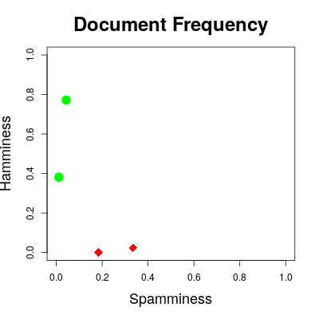

.1+|

|
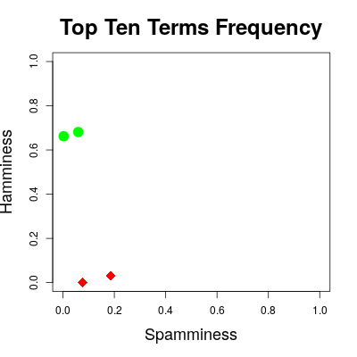

.1+|
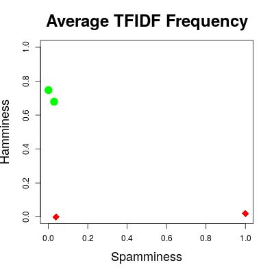
|=====================

== Accuracy

$ A(t) = (m_(00)(t) + m_(11)(t))/(m_(00)(t) + m_(01)(t) + m_(10)(t) + m_(11)(t)) $

where 

$m_(00)(t)$ is the number of messages actually spam and identified as spam (i.e, correct) 

$m_(01)(t)$ is the number of messages actually spam but identified as ham of (i.e., error)

$m_(10)(t)$ is the number of messages actually ham but identified as spam (i.e., error)

$m_(11)(t)$ is the number of messages actually ham and identified as ham (i.e., correct)

== Accuracy
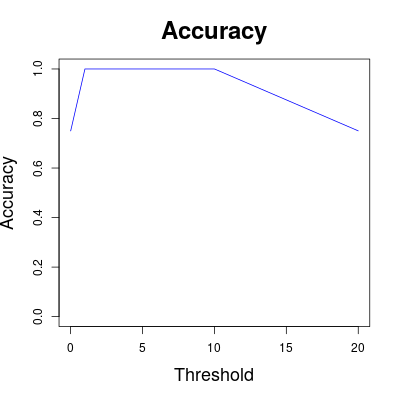

== Results

[cols="asciidoc,asciidoc"]
|=====================
|
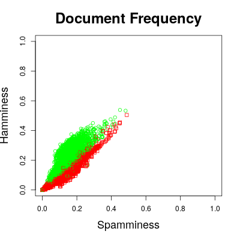

.1+|

|

.1+|
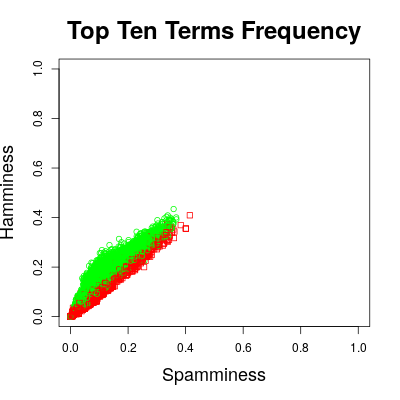
|=====================

== Accuracy

== Average Accuracy

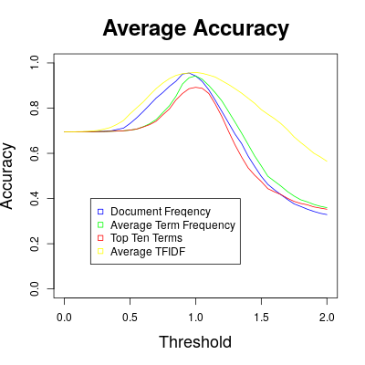

............................................................
|---------------------------+----------------------------|
|  Scenario                 |  Maximum Average Accuracy  |
|---------------------------+----------------------------|
|  document_similarity      |  0.955333                  |
|  average_term_similarity  |  0.942333                  |
|  top_ten_term_similarity  |  0.892                     |
|  average_tfidf_similarity |  0.958                     |
|---------------------------+----------------------------|
............................................................
